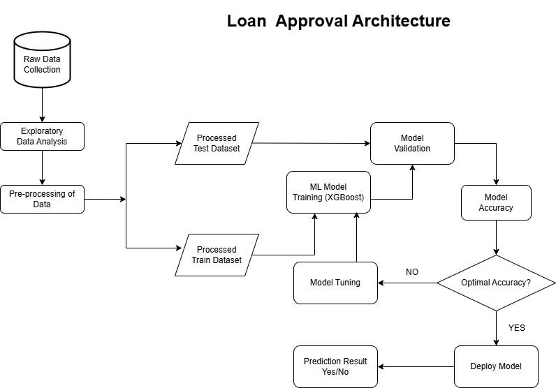

#  Loan Decision Project Summary

## Methodology, Approach & Model Selection Rationale

The goal of this project was to build an end-to-end loan approval prediction system using historical LendingClub data. The following steps were taken:

1. **Data Preparation**:
   - Loaded raw data and cleaned missing, inconsistent, and outlier values.
   - Encoded categorical variables using ordinal encoding.
   - Normalized numerical features and created engineered features (e.g., DTI ratios).

2. **Exploratory Data Analysis (EDA)**:
   - Investigated distributions and relationships using visualizations and summary statistics.
   - Identified strong predictors of loan status (e.g., `grade`, `int_rate`, `emp_length`, `annual_inc`, `dti`).
   - Addressed class imbalance and correlations.

3. **Modeling**:
   - Started with a **baseline model** (Logistic Regression) for interpretability.
   - Progressed to **XGBoost**, which provided improved accuracy, robustness to overfitting, and the ability to handle mixed data types.

**Model Selection Rationale**:
- **XGBoost** was chosen for its superior performance on tabular datasets, its built-in handling of missing values, and its interpretability using feature importance tools.

---

## Advantages & Limitations of the Chosen Model

### Comparison Summary

Compared to the baseline Logistic Regression model, the tuned XGBoost model achieved a higher ROC-AUC (**0.732 vs. 0.703**) and improved recall (**70% vs. 65.6%**), making it more effective at identifying defaulting borrowers. 
Precision remains low in both models, reflecting the challenge of false positives. 
However, XGBoost shows stronger overall performance and learning capacity. Further gains can be achieved through feature selection and engineering to help reduce noise and improve precision.

### Advantages:
- Higher accuracy and robustness.
- Handles non-linear feature interactions.
- Well-supported in production environments.

### Limitations:
- Requires careful hyperparameter tuning.
- May be sensitive to imbalanced datasets without proper preprocessing.
- Slightly heavier to deploy compared to simpler models (e.g., Logistic Regression).

---

## Architecture of the Final Solution

The diagram below illustrates the high-level architecture of the deployed loan approval prediction system:

## 🚀 Deployment & Scalability Considerations

- **Deployment**: The app is built using Streamlit, which supports rapid prototyping and public deployment. It can be containerized using Docker and deployed to cloud services such as AWS, Azure, etc.
- **Scalability**:
  - For small-to-medium use cases, Streamlit is sufficient.
  - For larger systems or integration into BAU tools, the model could be served via a REST API (e.g., FastAPI) with load balancing and a separate frontend.
- **BAU Use Case**: A loan officer or financial analyst can input client details and receive real-time risk assessments. 

---

## 📈 Estimated Impact / ROI

- **Faster Decisions**: Automating risk scoring reduces manual approval time from hours to seconds.
- **Improved Accuracy**: XGBoost model delivers higher approval precision, reducing default risk.
- **Business Value**:
  - Enables personalized offers.
  - Improves customer satisfaction.
  - Enhances regulatory compliance and consistency.

**Potential ROI**:
- For every 1,000 automated assessments/month:
  - 50+ hours saved in analyst time.
  - 5–10% potential improvement in approval decision accuracy.

---

*For more technical details, see the notebooks and app in the repo.*